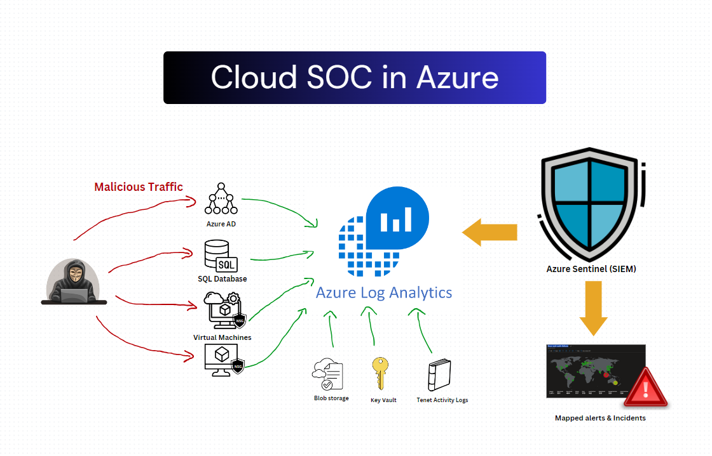

# Azure Cloud SOC with Honeynet Implementation (Live Traffic)


## Introduction

I built a scaled-down honeynet in Azure that ingests log sources from various resources into a Log Analytics workspace. These logs are then used by Microsoft Sentinel to populate attack maps, trigger alerts, and create incidents. Security metrics were taken before and after hardening to demostrate successful hardening capablitlites. 
**This is smaller verison made for demonstration purposes**

## Some tools used
- SecurityEvent (Windows Event Logs)
- Syslog (Linux Event Logs)
- SecurityAlert (Log Analytics Alerts Triggered)
- SecurityIncident (Incidents created by Sentinel)
- AzureNetworkAnalytics_CL (Malicious Flows allowed into our honeynet)

## Architecture Before Hardening / Security Controls


## Architecture After Hardening / Security Controls


The architecture in Azure consisted of the following components:

- Virtual Network (VNet)
- Network Security Group (NSG)
- Virtual Machines (2 windows, 1 linux)
- Log Analytics Workspace
- Azure Key Vault
- Azure Storage Account
- Microsoft Sentinel

"Before" metrics were resources intentionally left vulnerable to the internet. 

"After" metrics are of the very same resources after applying hardening strategies such as firewall rules and NSG configuration. 


## Attack Maps Before Hardening and Security Controls
<br>
<br>
<br>

## Metrics Before Hardening and Security Controls

The following table shows the metrics we measured in our insecure environment for 24 hours:
Start Time 2023-08-17 06:04:48
Stop Time 2023-08-18T06:04:48

| Metric                   | Count
| ------------------------ | -----
| SecurityEvent            | 36433
| Syslog                   | 534
| SecurityAlert            | 3
| SecurityIncident         | 107
| AzureNetworkAnalytics_CL | 45

## Attack Maps After Hardening and Security Controls
``` Some map queries actually returned no results due to no instances of malicious activity for the 24 hour period after hardening.```
<br>
<br>

## Metrics After Hardening / Security Controls

The following table shows the metrics we measured in our environment for another 24 hours, but after we have applied security controls:
Start Time 2023-09-02T23:35:41
Stop Time  2023-09-03T23:35:41

| Metric                   | Count
| ------------------------ | -----
| SecurityEvent            | 8279
| Syslog                   | 1
| SecurityAlert            | 1
| SecurityIncident         | 0
| AzureNetworkAnalytics_CL | 0

## Conclusion

I've demonstrated an extremely scaled down representation the SOC I implemented during my employment.
